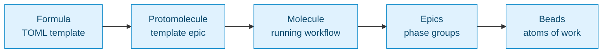
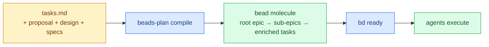
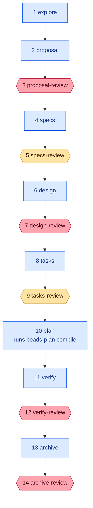

# beads-plan

Convert [OpenSpec](https://github.com/steveyegge/openspec) task plans into executable [beads](https://github.com/steveyegge/beads) workflows — with complexity assessment, tier-based agent dispatch, and parallelism analysis.

**beads-plan** bridges the gap between spec-driven planning and agent-driven execution. It reads OpenSpec artifacts (proposal, design, specs, tasks) and produces a fully-wired beads molecule: nested epics, enriched leaf tasks, dependency edges, and metadata that tells agents what capability tier each task needs.

## Where it fits in the MEOW stack

[MEOW](https://steve-yegge.medium.com/welcome-to-gas-town-4f25ee16dd04) (Molecular Expression of Work) is the five-layer orchestration model from Steve Yegge's Gas Town:



beads-plan operates at the **Protomolecule → Molecule** transition:



It takes a structured plan (tasks.md + specs + design) and compiles it into a dependency graph of beads that agents can execute via `bd ready`.

### The `meow-openspec` formula

Compiling the apply phase is only half of the story. The project also ships a beads formula, `.beads/formulas/meow-openspec.formula.toml`, that wraps the full OpenSpec lifecycle in a gated bead molecule: every phase transition is a human-in-the-loop review that must be resolved before the next phase proceeds. Pour it with:

```sh
bd mol pour meow-openspec --var change_dir=openspec/changes/my-change --var change=my-change
```

This creates fourteen beads in order — seven work phases interleaved with six mandatory human review gates — and hands them to `bd ready`:



Red hexagons are the four mandatory review gates that define the floor — nothing proceeds past proposal, past design, past verify, or into archive without a human resolving the gate. Yellow hexagons are the additional specs/tasks review gates (hardcoded in v1). At each gate a reviewer runs `bd gate resolve <gate-id>` or `bd human respond <id>` to unblock the next phase.

## Installation

### Homebrew (recommended)

```sh
brew tap pstradowski/beads-plan
brew install beads-plan
```

### Go install

```sh
go install github.com/pstradowski/beads-plan/cmd/beads-plan@latest
```

Make sure `$(go env GOPATH)/bin` is on your PATH.

### From source

```sh
git clone https://github.com/pstradowski/beads-plan.git
cd beads-plan
make install
```

### Prerequisites

- [bd](https://github.com/steveyegge/beads) — required for `compile` and `view` commands
- [openspec](https://github.com/steveyegge/openspec) — optional, for `compile` command only

## Quick start

```sh
# 1. Preview what beads-plan would create (no side effects)
beads-plan compile --dry-run path/to/openspec/changes/my-feature

# 2. Create the beads molecule for real
beads-plan compile path/to/openspec/changes/my-feature

# 3. Start working — bd ready shows unblocked tasks
bd ready

# 4. Generate a tasks.md view from the live beads
beads-plan view TradeBase-abc

# 5. Emit agent skill definition
beads-plan prime > SKILL.md
```

## Commands

### `beads-plan compile <change-dir>`

Compile an OpenSpec change directory into apply-phase beads: a nested epic, enriched leaf tasks, and dependency edges. This command is a leaf tool — for the gated OpenSpec lifecycle with human-in-the-loop checkpoints, pour the `meow-openspec` beads formula via `bd mol pour meow-openspec`, which invokes `compile` at its compile step.

**What it does:**
1. Parses `tasks.md` into sections and checkbox tasks
2. Reads `proposal.md`, `design.md`, and `specs/` for context
3. Creates a 3-level bead hierarchy: root epic → sub-epics → leaf tasks
4. Assesses complexity (low/medium/high) and assigns tiers (fast/standard/advanced)
5. Analyzes parallelism at section and task level
6. Enriches each leaf task with relevant proposal context, design decisions, acceptance criteria, and task output schema
7. Wires dependency edges via `bd dep add`
8. Single-task sections are collapsed (no unnecessary sub-epic wrapper)

**Flags:**

| Flag | Description |
|------|-------------|
| `--dry-run` | Preview planned structure without creating beads |
| `--profile <name>` | Select provider profile for tier → model resolution |
| `--json` | Output structured JSON |

### `beads-plan view <epic-id>`

Generate an OpenSpec-compatible `tasks.md` from a beads epic hierarchy.

The output includes:
- Numbered H2 sections from sub-epics
- Checkbox lines with completion status from bead state
- Inline bead IDs and tier tags as HTML comments
- Header comment with epic ID and generation timestamp
- Progress footer with completion percentage

**Flags:**

| Flag | Description |
|------|-------------|
| `-o, --output <file>` | Write to file instead of stdout |
| `--json` | Output structured JSON |

### `beads-plan prime`

Output a SKILL.md that teaches a coding agent how to use beads-plan, interpret metadata fields (tiers, parallelism, task output), and dispatch subagents.

## Provider profiles

beads-plan uses abstract **tiers** (fast / standard / advanced) instead of vendor-specific model names. A config file maps tiers to concrete models:

```toml
# .beads-plan.toml (repo root or ~/.config/beads-plan/)
default_profile = "anthropic"

[profile.anthropic]
fast = "haiku"
standard = "sonnet"
advanced = "opus"

[profile.openai]
fast = "gpt-4o-mini"
standard = "gpt-4o"
advanced = "o3"
```

Config file discovery order:
1. Current directory → parent directories (up to git root)
2. `~/.config/beads-plan/config.toml`

Use `--profile` to override: `beads-plan compile --profile openai ./changes/my-feature`

Without a profile, tiers are stored in metadata but no model string is resolved.

## Metadata schema

Each leaf task bead includes structured metadata for agent consumption:

| Field | Values | Description |
|-------|--------|-------------|
| `tier` | fast, standard, advanced | Capability tier for agent dispatch |
| `complexity` | low, medium, high | Assessed task complexity |
| `model` | *(provider-specific)* | Concrete model when profile is active |
| `change` | *(change name)* | OpenSpec change provenance |

Parent beads (epics, sub-epics) carry parallelism metadata:

| Field | Values | Description |
|-------|--------|-------------|
| `parallelism` | parallel, sequential, mixed | Execution mode for children |
| `parallel_groups` | `[[id,...], ...]` | Groups of concurrent children |

### Task output protocol

Each leaf task's notes include the expected output schema. After completing a task, agents should record:
- **files_changed** — list of file paths created or modified
- **decisions** — architectural or implementation decisions made
- **discoveries** — unexpected findings or issues encountered

## Complexity heuristics

Tasks are classified based on keywords in the title and spec/design context:

| Complexity | Tier | Signals |
|-----------|------|---------|
| **Low** | fast | config, scaffold, boilerplate, rename, gitignore |
| **Medium** | standard | handler, database, integration, service, tests |
| **High** | advanced | architecture, refactor, distributed, security, cross-cutting |

## Development

```sh
make build    # Build to ./build/beads-plan
make test     # Run all tests
make lint     # Run golangci-lint
make install  # Install to GOPATH/bin
```

Pre-commit hook runs `go vet` and `gofmt` check automatically.

### Git workflow

This project uses Git Flow:
- `main` — production releases
- `develop` — integration branch
- `feature/*` — new work branches from develop

## License

MIT
