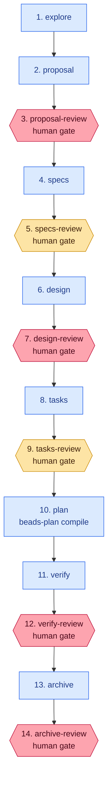

## Context

beads-plan today is a one-shot compiler: read `openspec/changes/<name>/{proposal,design,specs,tasks}.md`, emit a nested bead hierarchy for the apply phase, exit. The OpenSpec lifecycle around that compile step — exploration, drafting, spec-writing, verification, archival — runs via a set of skills (`openspec-explore`, `openspec-new-change`, `openspec-apply-change`, `openspec-verify-change`, `openspec-archive-change`) that operators invoke by hand. There is no single entity that tracks "we are at step N of change M, waiting on gate G" across sessions.

In parallel, beads grew a full MEOW-stack infrastructure that this repo currently underuses:

- **Formulas** (`.beads/formulas/*.formula.toml`) — reusable template DAGs with variables, steps, and composition rules.
- **Cook** — compile a formula into a proto (template epic).
- **Pour / Wisp** — instantiate a proto as a persistent molecule (pour) or ephemeral one (wisp).
- **Gates** — async wait conditions attached to steps: `human` (manual close), `timer`, `gh:run`, `gh:pr`, `bead` (cross-rig wait). A gated step is blocked until its gate is resolved.
- **`bd mol ready --gated`** — discovery command that finds molecules where a gate has closed and the next step is ready.
- **`bd human`** — view/list/respond to beads labeled `human`.

The `Formula → Protomolecule → Molecule → Epics → Beads` stack is already implemented in beads. What's missing is a formula that encodes the **OpenSpec-specific** lifecycle, and a way for that formula to delegate the apply-phase compile to beads-plan.

This change designs that wiring — with the explicit stance that **beads drives and beads-plan is a leaf tool**, not the other way around.

## Goals / Non-Goals

**Goals**

- Ship a single reusable formula (`meow-openspec`) that represents the full OpenSpec lifecycle as a gated bead molecule. Any contributor can run `bd mol pour meow-openspec --var change_dir=openspec/changes/my-change` and get a complete workflow instance.
- Make human-in-the-loop explicit and enforceable. The molecule **cannot** reach verification without a human closing the `proposal-accepted` and `design-accepted` gates, and cannot archive without closing `verify-accepted` and `archive-accepted`. Earlier (`specs`, `tasks`) gates are on by default and suppressible; `explore` is off by default.
- Give test tasks a structured correction contract: a failing test cannot be silently ticked off. The test-task epic can only close when the latest `run-tests-N` bead has closed clean.
- Preserve everything that works today. `beads-plan compile` keeps its current contract and command name; it just gains two new flags (`--parent`, `--json`) so a formula step can call it. `beads-plan view` keeps working against the apply-phase epic.
- Keep the formula legible. A developer reading `meow-openspec.formula.toml` should be able to tell what each step does, what gate (if any) guards it, and what variables drive it without reading Go source.
- Keep beads-plan small. All new workflow logic lives in the formula. beads-plan gains only what it needs to be callable from a step: two flags and a test-task compile branch.

**Non-Goals**

- Not wrapping beads behind a new beads-plan subcommand. Specifically: **no `beads-plan pour`**. The entry point is `bd mol pour`.
- Not automating human approval. The point of gates is to *stop* at review points; trying to automate them defeats the feature.
- Not replacing the OpenSpec CLI. Wherever a step corresponds to an OpenSpec operation, the formula shells out to `openspec new`, `openspec status`, `openspec archive` exactly as the existing skills do.
- Not implementing this change in the same PR. Scope for this change is: the formula file, the two new flags on `beads-plan compile`, the test-task compile branch, and the two capability specs.
- Not trying to capture the whole multi-change ecosystem. One molecule corresponds to one OpenSpec change; bonding multiple changes together is future work.

## Decisions

### D1. Formula is the source of truth for workflow shape; beads-plan is a leaf tool

The formula file drives the molecule topology. beads-plan knows nothing about the lifecycle — it knows only about the apply phase. When the formula reaches step 6 (`plan`), it invokes `beads-plan compile {{change_dir}} --parent {{step.bead_id}} --json` as a subprocess. beads-plan parses the change, enriches tasks, and emits the apply-phase atoms as children of the step's bead. It returns a JSON summary that the formula step captures and the next step can reference.

Rationale: the MEOW stack already has a workflow-orchestration primitive (`bd formula` / `bd cook` / `bd mol pour`). Building a parallel one in Go would duplicate that primitive, hide the workflow from `bd mol show`, and force every future integration (dashboards, status polling, skill wrappers) to know about two different places. Keeping beads-plan as a leaf tool means anything that understands a beads molecule automatically understands the whole lifecycle.

### D2. Phase structure

**Original intent.** Nine steps — one per lifecycle phase — with gates as modifiers attached via the `gate` field, some mandatory and some suppressible via `--skip-gates`.

**v1 reality.** The beads 1.0.0 formula TOML schema supports neither conditional steps based on variables nor an `exec` field, so suppression at cook-time isn't expressible. The formula instead produces **fourteen** steps: seven work phases interleaved with six mandatory human review steps (each review is its own bead with a `gate = { type = "human" }` field):

```
  Step               Produces / role
  ─────────────────  ─────────────────────────────────────
  1.  explore            optional context-gathering, no gate
  2.  proposal           proposal.md
  3.  proposal-review    human gate — blocks specs
  4.  specs              specs/<cap>/spec.md
  5.  specs-review       human gate — blocks design
  6.  design             design.md
  7.  design-review      human gate — blocks tasks
  8.  tasks              tasks.md
  9.  tasks-review       human gate — blocks plan
  10. plan               compile apply-phase atoms (beads-plan compile)
  11. verify             openspec verify pass
  12. verify-review      human gate — blocks archive
  13. archive            openspec archive
  14. archive-review     human gate — final checkpoint
```



Legend: blue boxes are work steps; yellow hexagons are human review gates; red hexagons are the four mandatory gates the user explicitly asked for (proposal, design, verify, archive). In v1 the yellow and red gates behave identically — all are hardcoded on. In v2 the yellow gates become suppressible via `--var skip_gates=specs,tasks`.

All six review gates are hardcoded as mandatory in v1. The spec scenarios still describe "proposal / design / verify / archive are mandatory" as the floor the user explicitly asked for, but v1 also hardcodes `specs-review` and `tasks-review`. Net effect: more friction than the spec's "default-on-suppressible" intent, but strictly more safety — nothing is silently skipped.

Rationale: the user's stated floor (proposal / design / verify / archive) is preserved. The extra two gates (`specs-review`, `tasks-review`) add friction for small changes but don't violate the floor. v2 will add conditional gates when the beads formula schema supports them — tracked in `beads-plan-c45`.

### D3. Gate mechanics

Each review step uses the formula `gate` field with type `human`. The gate bead is auto-created by `bd cook` when the formula is poured. It sits there blocking the review step (and therefore everything downstream). A reviewer inspects the artifact (e.g., reads `proposal.md`), then runs `bd gate resolve <gate-id>` (or `bd human respond <id>`). `bd mol ready --gated` picks the molecule back up and the next step unblocks.

**Review context via descriptions, not structured metadata (v1).** The original design had gate beads carry metadata `{"change": "...", "phase": "proposal", "artifact": "openspec/changes/<name>/proposal.md"}`. That's not achievable in v1: the beads 1.0.0 formula schema silently drops the `metadata` field on steps. Instead, each review step's `description` field carries the same information in prose form — which artifact to read, what to check for, the `bd gate resolve` command, and what to do if problems are found. Reviewers still get what they need via `bd show <review-bead-id>`, just as human-readable text instead of structured data.

Rationale: this is what beads' `gate` subsystem was built for; reusing it keeps the tooling (`bd gate list`, `bd gate resolve`, `bd mol ready --gated`) working unchanged. The descriptive approach is less programmable (a tool can't query "which phase is this gate about?" via `bd show --json`) but the information is preserved for the humans who actually use it.

### D4. Apply phase composes with the existing planner — via step description instructions (v1), not auto-exec

**Original intent.** Step 6 (`plan`) was going to be a formula step whose `exec` field invoked `beads-plan compile {{change_dir}} --parent {{self.bead_id}} --json` and captured the JSON summary into an `apply_compile` name for downstream steps to reference.

**v1 reality (discovered during section 7 implementation).** The beads 1.0.0 formula TOML schema does **not** expose `exec`, `command`, `run`, `capture`, or any equivalent field on steps — all of them silently cook to empty. A formula step is a pure declarative bead blueprint, not a workflow-runner directive. Steps are picked up by agents via `bd ready`, not auto-executed.

**v1 implementation.** The `plan` step carries its compile instructions in the bead's `description`, not in an `exec` field. When an agent claims the step, they read the description and run:

```sh
beads-plan compile {{change_dir}} --parent <this-bead-id> --json
```

They then record the returned `root_id` in the step bead's metadata:

```sh
bd update <this-bead-id> --metadata '{"apply_compile_root": "<root_id>"}'
```

The plan step is declared with `waits_for = "all-children"` (this field **is** supported by the schema), so it stays `in_progress` while agents work through the compiled apply-phase atoms. When every compiled child bead closes, the plan step is eligible to close and unblocks `verify`.

Rationale: zero duplication of the parse/enrich pipeline is still achieved — nothing compiles apply-phase beads except `beads-plan compile`. What's lost is the automatic invocation; a human or agent has to initiate the compile step rather than the formula runtime doing it for them. Given that every other step in the lifecycle is agent-driven anyway, the inconsistency is minimal.

**v2.** If the beads formula schema adds `exec` support, this descope reverts to the original design: move the command from the description to an `exec` field, and add a capture mechanism so the verify step can reference the compile result programmatically. Tracked in follow-up issue `beads-plan-c45`.

### D5. `beads-plan compile` gains two flags, nothing else

- `--parent <bead-id>`: create the root epic as a child of the given bead instead of standalone. Threads through `internal/planner/planner.go` `CreateRootEpic` via a new optional `ParentID` field on its options struct. Passed to `bd create --parent <id>` in `bdclient.go`.
- `--json`: emit a machine-readable summary on stdout after the plan completes:
  ```json
  {
    "root_id": "beads-plan-abc",
    "leaf_ids": ["beads-plan-def", "beads-plan-ghi"],
    "test_task_ids": ["beads-plan-ghi"],
    "tiers": {"beads-plan-def": "standard", "beads-plan-ghi": "advanced"}
  }
  ```
  This is the contract the formula's `capture` field consumes.

No new subcommand. No `beads-plan pour`. No library extraction. No sidecar files on disk.

Rationale: minimum surface area. The two flags exist only because a formula step needs a way to graft output into an existing hierarchy and a way to report structure back. Everything else a workflow needs is already in `bd`.

### D6. Test-correction: beads-plan compiles the structure, formula drives the loop

For each task detected as a test task, the planner replaces the single leaf bead with a four-bead sub-epic at compile time:

```
  test-task (epic, labeled "meow:test")
  ├── execute        (do the work described by the task)
  ├── run-tests-1    (depends-on: execute; runs the tests)
  └── correct-1      (empty stub, blocked by run-tests-1 failing)
```

At compile time that's all beads-plan does. The retry loop lives in the formula as a sub-pattern. When `run-tests-N` closes with metadata `{"outcome": "fail"}`, the formula's test-retry watcher spawns `correct-N` → waits for close → spawns `run-tests-(N+1)` → repeats. When `run-tests-N` closes with `{"outcome": "pass"}`, the formula closes the parent `test-task` epic.

The max retry count is a formula variable: `test_retry_cap`, **default 1** (one retry attempt after the first failure). Operators override it per pour via `--var test_retry_cap=N`; `0` means "no retry, escalate on first failure"; larger values allow more attempts. If the loop would spawn `run-tests-(cap+2)`, the formula instead creates a `bd human` bead labeled `meow:stuck-test` that contains the list of failing test runs and blocks the `apply` step until a human resolves it.

Test detection is layered:
1. **Explicit:** a task line with an inline metadata marker like `- [ ] 1.3 Add unit tests for parser <!-- test -->`. Preferred path; always wins.
2. **Section-based:** every task in a section whose title matches `/test/i` (e.g., "Tests", "Unit Tests", "Integration tests").
3. **Keyword fallback:** task title contains `test` / `tests` as a whole word, unless the section is clearly non-test (e.g., "Refactor", "Document").

Rationale: tests are the one place where "close the checkbox" is a lie if the test doesn't pass. Making the failure path a first-class bead enforces the retest. Splitting compile (beads-plan) from runtime (formula) keeps the retry cap tunable without a beads-plan release.

### D7. Formula location and phase — confirmed liquid

- File: `.beads/formulas/meow-openspec.formula.toml` (checked into git so every contributor shares the same template).
- Phase: `liquid` (persistent). Instantiate via `bd mol pour`, never `bd mol wisp`. The formula file declares `phase = "liquid"` so pouring as vapor produces a warning.

Rationale: OpenSpec changes are high-audit — operators will want to look back at when proposal was accepted, what the verify report said, and which gates were resolved by whom. Vapor molecules evaporate the moment the change closes, which destroys exactly the audit we want.

### D8. Variables the formula accepts

**v1.**

```
change_dir   (required) path to openspec/changes/<name>/
change       (optional) change identifier used in titles; default "<change>" placeholder
```

v1 accepts only these two variables. The richer variable surface the original design proposed — `skip_gates`, `add_gates`, `test_retry_cap` — is deferred to v2 because the beads formula schema has no `exec`-or-validation pathway that could actually honor them. Unknown variables passed via `--var` are silently accepted by the schema, which means an operator who passes `--var skip_gates=proposal` will get no error and no effect; the formula's file-header documentation calls this out explicitly.

**Why `change` has no automatic derivation.** The natural default would be `basename(change_dir)`, but beads formula variables do not support computed defaults — only literal strings. The placeholder `<change>` makes it obvious when a real pour has forgotten to pass `--var change=…`.

**v2.**

```
change_dir       (required) path to openspec/changes/<name>/
change           (optional) identifier, auto-derived from change_dir basename
skip_gates       (optional) comma-separated list from {specs,tasks}
add_gates        (optional) comma-separated list from {explore}
test_retry_cap   (optional) integer, default 1; max retries after the initial run-tests failure
```

In v2, attempts to suppress a mandatory gate (`proposal`, `design`, `verify`, `archive`) via `skip_gates` will fail with a formula validation error, and unknown variables will be rejected. v2 is tracked by follow-up issue `beads-plan-c45`.

Rationale for the v1 surface: keep the contract narrow enough that the formula can actually deliver on every variable it declares. v1 ships with two honest variables rather than five aspirational ones.

## Risks / Trade-offs

- **Formula schema drift.** beads' formula schema is marked experimental. If the schema breaks between beads versions, our checked-in formula will break. **Mitigation:** a `bd mol seed meow-openspec` smoke test in CI that verifies the formula still compiles; pin a minimum `bd` version in the formula's prerequisites.
- **JSON contract drift.** The `--json` summary beads-plan emits is a contract the formula consumes. If we change one without the other, the plan step breaks silently. **Mitigation:** the test-correction spec (see capability `meow-test-correction-loop`) will describe the JSON schema explicitly, and beads-plan will have a test that asserts the emitted shape.
- **Gate fatigue.** Four mandatory gates plus two optional ones can be a lot of friction for small changes. **Mitigation:** `--skip-gates` at pour time suppresses the optional ones; mandatory gates stay. And eventually a per-change `.openspec.yaml` setting so operators don't have to remember flags.
- **Test detection heuristic misfires.** A task titled "Test that migration is safe" that isn't literally a test task will get the correction sub-molecule it doesn't need. **Mitigation:** explicit inline metadata is the preferred path; the heuristic is a fallback. Operators annotate tasks.md explicitly for anything important.
- **Correction loop non-convergence.** A pathological case where `correct → run-tests → correct → run-tests → …` never converges. **Mitigation:** `test_retry_cap` caps iterations; exceeding the cap escalates via `bd human` rather than looping forever.
- **Two places to read workflow logic — Go and TOML.** Today the workflow is in Go; with this change, phase/gate logic is in TOML and compile/enrich logic stays in Go. **Mitigation:** the split is unambiguous: *anything about lifecycle* is in the formula; *anything about parsing OpenSpec markdown* is in Go. The capability specs make that boundary explicit.
- **Subprocess invocation cost.** Step 6 shells out to `beads-plan`, which itself shells out to `bd` for every leaf task. For a large change, that's a lot of processes. **Mitigation:** acceptable for now — beads-plan already works this way today. If it becomes a bottleneck, the `BeadClient` interface already exists for a future in-process mode.

## Open questions for review

Before committing to implementation, please confirm (or redirect):

1. ~~**Mandatory-gate set.**~~ *Resolved: proposal + design + verify + archive are mandatory; specs and tasks are default-on-suppressible; explore is default-off.*
2. ~~**Formula phase.**~~ *Resolved: liquid. Declared in the formula file; pouring as vapor produces a warning.*
3. ~~**`plan` vs rename.**~~ *Resolved: rename `plan` → `compile`. The name signals its leaf-tool role — it compiles a change directory into apply-phase atoms; it does not orchestrate.*
4. ~~**Test-correction iteration cap.**~~ *Resolved: `test_retry_cap` defaults to 1 (one retry after the first failure, then escalate to `bd human` with label `meow:stuck-test`). Overridable per-pour via `--var test_retry_cap=N`, including `0` (no retry — escalate immediately) and larger values.*
5. ~~**Scope for this change.**~~ *Resolved: bundled. Formula + `compile` rename + `--parent`/`--json` flags + test-correction compile branch + both capability specs ship as one change. If the test-correction branch blows up in scope during implementation, we split it off then rather than up-front.*
