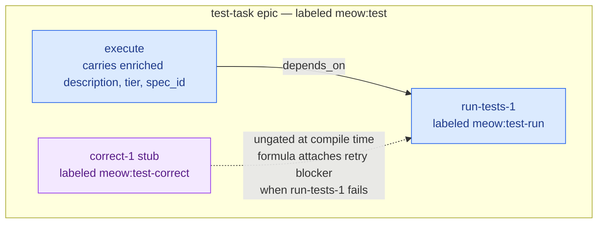

## ADDED Requirements

### Requirement: Test task detection is layered

`beads-plan compile` SHALL classify a task as a test task using three layered detection rules, evaluated in priority order. The first rule that matches wins.

1. **Explicit marker:** the task line contains an HTML comment `<!-- test -->` (whitespace-tolerant) anywhere after the checkbox.
2. **Section-based:** the task appears in a section whose title matches the case-insensitive regex `/\btest(s|ing)?\b/`.
3. **Keyword fallback:** the task title contains `test`, `tests`, or `testing` as a whole word, AND the enclosing section title does NOT match a non-test regex `/\b(refactor|document|docs|rename)\b/i`.

A task that matches none of the three rules is a regular (non-test) task.

#### Scenario: Explicit marker always wins
- **WHEN** `tasks.md` contains `- [ ] 2.3 Implement parser <!-- test -->` in a section titled "## 2. Implementation"
- **THEN** `beads-plan compile` emits a test-task sub-epic for task 2.3 even though the section is not a test section

#### Scenario: Section-based detection catches all tasks in a Tests section
- **WHEN** `tasks.md` contains a section `## 5. Tests` with tasks 5.1 and 5.2, neither of which carries an explicit marker
- **THEN** `beads-plan compile` emits a test-task sub-epic for both 5.1 and 5.2

#### Scenario: Keyword fallback catches obvious test tasks
- **WHEN** a section titled `## 3. Implementation` contains `- [ ] 3.4 Add unit tests for the parser`
- **THEN** `beads-plan compile` emits a test-task sub-epic for task 3.4

#### Scenario: Keyword fallback is suppressed in non-test sections
- **WHEN** a section titled `## 4. Refactor` contains `- [ ] 4.1 Test that the new interface compiles`
- **THEN** `beads-plan compile` emits task 4.1 as a regular leaf task, not a test-task sub-epic

### Requirement: Compile-time test-task sub-epic shape

For every task classified as a test task, `beads-plan compile` SHALL replace the single leaf bead with a four-bead sub-epic:

- **`test-task` epic** — bead of type `epic`, labeled `meow:test`, titled after the original task text. It is a child of the section's sub-epic (or the root epic for single-task sections, per the existing single-task collapse rule).
- **`execute` task** — child of `test-task`, carries the enriched description, acceptance criteria, design context, and tier that would have been on the original leaf.
- **`run-tests-1` task** — child of `test-task`, depends on `execute`, labeled `meow:test-run`, metadata `{"iteration": 1}`.
- **`correct-1` stub** — child of `test-task`, labeled `meow:test-correct`, metadata `{"iteration": 1}`. Starts in status `open` but is ungated; the formula's retry pattern attaches a blocker at runtime when `run-tests-1` closes failed.



The solid arrow is a compile-time `bd dep add` edge. The dashed arrow is a runtime relationship the formula creates only on test failure (v2 — in v1 the correction loop is driven manually by agents).

#### Scenario: Test task compiles to four beads
- **WHEN** `beads-plan compile` processes a detected test task
- **THEN** the compiler creates one epic bead and three task beads under it, with the labels `meow:test`, `meow:test-run`, and `meow:test-correct` applied as described

#### Scenario: Execute depends on nothing within the sub-epic
- **WHEN** `bd show <execute-bead-id>` is inspected
- **THEN** the execute bead has no intra-sub-epic depends-on edges and can start as soon as the parent `test-task` epic is ready

#### Scenario: Run-tests depends on execute
- **WHEN** `bd show <run-tests-1-id>` is inspected
- **THEN** the bead has a depends-on edge to the `execute` bead

#### Scenario: Single-task collapse still applies around test tasks
- **WHEN** a section contains exactly one task and that task is a test task
- **THEN** the `test-task` epic is created directly under the root epic, skipping the sub-epic wrapper the existing single-task collapse rule elides, while the four-bead internal structure is preserved

### Requirement: JSON summary contract

When `beads-plan compile` is invoked with `--json`, it SHALL emit on stdout a single JSON object with the following shape, after all bead creation succeeds:

```json
{
  "root_id": "string",
  "leaf_ids": ["string", "..."],
  "test_task_ids": ["string", "..."],
  "tiers": { "<bead-id>": "fast|standard|advanced" }
}
```

- `root_id` — the bead ID of the root epic created by this compile run (child of `--parent` when supplied).
- `leaf_ids` — every leaf task bead created, **including** the `execute` bead of each test-task sub-epic but **excluding** `run-tests-N` and `correct-N` beads.
- `test_task_ids` — the bead IDs of every `test-task` epic created.
- `tiers` — a map from every leaf bead ID in `leaf_ids` to its assigned tier.

No other fields appear at the top level of the JSON object in this version of the contract.

#### Scenario: JSON is emitted on success
- **WHEN** `beads-plan compile openspec/changes/example --parent bd-123 --json` exits with status 0
- **THEN** stdout contains exactly one line that parses as a JSON object with the four top-level fields `root_id`, `leaf_ids`, `test_task_ids`, and `tiers`

#### Scenario: Test-task execute beads are in leaf_ids
- **WHEN** a compile run produces two test-task sub-epics and three regular leaf tasks
- **THEN** `leaf_ids` has length 5 (three regular leaves plus two `execute` beads), and `test_task_ids` has length 2

#### Scenario: Tiers map covers every leaf
- **WHEN** the JSON is parsed
- **THEN** every bead ID listed in `leaf_ids` appears as a key in the `tiers` map, and every value is one of `fast`, `standard`, or `advanced`

#### Scenario: Compile failure emits no JSON
- **WHEN** `beads-plan compile` exits with a non-zero status because bead creation failed
- **THEN** stdout contains no JSON object (diagnostics go to stderr); consumers can rely on exit status to detect failure

### Requirement: Runtime retry loop in the formula

The `meow-openspec` formula SHALL implement a test-retry sub-pattern that, for every bead labeled `meow:test`, watches the latest `run-tests-N` child bead and, upon that bead closing with metadata `{"outcome": "fail"}`, spawns a `correct-(N+1)` bead that depends on the closed `run-tests-N` and, upon `correct-(N+1)` closing, spawns a new `run-tests-(N+1)` bead that depends on the closed `correct-(N+1)`.

#### Scenario: Failed run-tests triggers a correct bead
- **WHEN** `run-tests-1` closes with metadata `{"outcome": "fail"}`
- **THEN** the formula creates a new `correct-2` bead as a child of the same `test-task` epic, with a depends-on edge to `run-tests-1` and label `meow:test-correct`

#### Scenario: Correct closing triggers a new run-tests
- **WHEN** `correct-2` closes
- **THEN** the formula creates a new `run-tests-2` bead as a child of the same `test-task` epic, with a depends-on edge to `correct-2` and label `meow:test-run`

#### Scenario: Passing run-tests closes the parent test-task
- **WHEN** `run-tests-N` closes with metadata `{"outcome": "pass"}` for any N
- **THEN** the formula closes the parent `test-task` epic and does not spawn any further `correct` or `run-tests` beads

### Requirement: Retry cap and human escalation

The formula SHALL read the `test_retry_cap` variable (default `1`, integer, non-negative) and SHALL limit the number of `correct → re-run-tests` cycles to that value. A cap of `0` means no retry is allowed. When the cap is exceeded (i.e., the formula would need to create `run-tests-(cap+2)`), the formula SHALL instead create a `bd human` bead labeled `meow:stuck-test` that blocks the `apply` step and contains references to every `run-tests-N` bead that ran.

#### Scenario: Default cap allows exactly one retry
- **WHEN** the molecule is poured with default `test_retry_cap=1` and `run-tests-1` fails
- **THEN** the formula spawns `correct-2` then `run-tests-2`; if `run-tests-2` also fails, the formula stops the retry loop and creates a `meow:stuck-test` human bead

#### Scenario: Cap zero escalates on first failure
- **WHEN** the molecule is poured with `test_retry_cap=0` and `run-tests-1` fails
- **THEN** the formula does not spawn a `correct-2`, and immediately creates a `meow:stuck-test` human bead blocking the `apply` step

#### Scenario: Larger cap permits more retries
- **WHEN** the molecule is poured with `test_retry_cap=3` and `run-tests-1` through `run-tests-3` all fail
- **THEN** the formula spawns up to `correct-4` and `run-tests-4` before escalating; escalation happens only if `run-tests-4` also fails

#### Scenario: Stuck-test bead blocks apply
- **WHEN** a `meow:stuck-test` bead is created
- **THEN** the `apply` step transitions to `blocked` with a depends-on edge to the stuck-test bead, and `bd human list` shows the bead with an `artifact` metadata field pointing at the offending test task in `tasks.md`

#### Scenario: Resolving the human bead reopens the retry loop
- **WHEN** a reviewer runs `bd human respond <stuck-test-id>` after fixing the underlying problem
- **AND** `bd mol ready --gated` runs
- **THEN** the formula creates a fresh `run-tests-(N+1)` bead and the loop resumes from that point; the retry counter does not reset

### Requirement: Parent test-task close semantics

A `test-task` epic SHALL close only when its most recently created `run-tests-N` child has closed with metadata `{"outcome": "pass"}`. Closing a `test-task` epic by any other means (manual `bd close`, ancestor cascade) while a `run-tests-N` bead is still open or closed with `{"outcome": "fail"}` SHALL emit a warning and the `apply` step SHALL NOT treat the work as complete.

#### Scenario: Parent closes after passing test
- **WHEN** the latest `run-tests-N` closes with `{"outcome": "pass"}`
- **THEN** the formula closes the parent `test-task` epic and the `apply` step counts the task as done

#### Scenario: Manual close is flagged
- **WHEN** an operator runs `bd close <test-task-epic-id>` while the latest `run-tests-N` is still open
- **THEN** `bd` (or the formula's close watcher) emits a warning that the test-task is being force-closed without a passing test run, and the `apply` step does not mark the underlying tasks.md checkbox as complete
